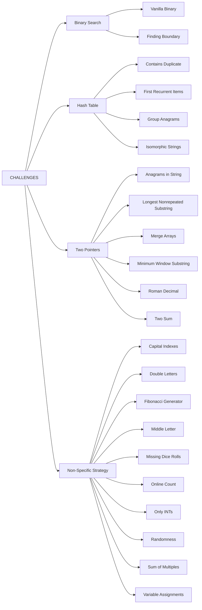

# Python Challenges

This is a collection of solutions (written in Python) for a variety of challenges in Algorithms and Data Structures.

```mermaid
    flowchart LR
        CHALLENGES
        CHALLENGES --> BS[Binary Search]
        CHALLENGES --> HT[Hash Table]
        CHALLENGES --> TP[Two Pointers]
        CHALLENGES --> NE[Non-Specific Strategy]

        BS --> VanillaBinary[Vanilla Binary]
        BS --> FindingBoundary[Finding Boundary]

        HT --> ContainsDuplicate[Contains Duplicate]
        HT --> FirstRecurrentItems[First Recurrent Items]
        HT --> GroupAnagrams[Group Anagrams]
        HT --> IsomorphicStrings[Isomorphic Strings]

        TP --> AnagramsInString[Anagrams in String]
        TP --> LongestNonrepeatedSubstring[Longest Nonrepeated Substring]
        TP --> MergeArrays[Merge Arrays]
        TP --> MinWindowSubstring[Minimum Window Substring]
        TP --> RomanDecimal[Roman Decimal]
        TP --> TwoSum[Two Sum]

        NE --> CapitalIndexes[Capital Indexes]
        NE --> DoubleLetters[Double Letters]
        NE --> FibonacciGenerator[Fibonacci Generator]
        NE --> MiddleLetter[Middle Letter]
        NE --> MissingDiceRolls[Missing Dice Rolls]
        NE --> OnlineCount[Online Count]
        NE --> OnlyINTs[Only INTs]
        NE --> Randomness
        NE --> SumOfMultiples[Sum of Multiples]
        NE --> VariableAssignments[Variable Assignments]
```
